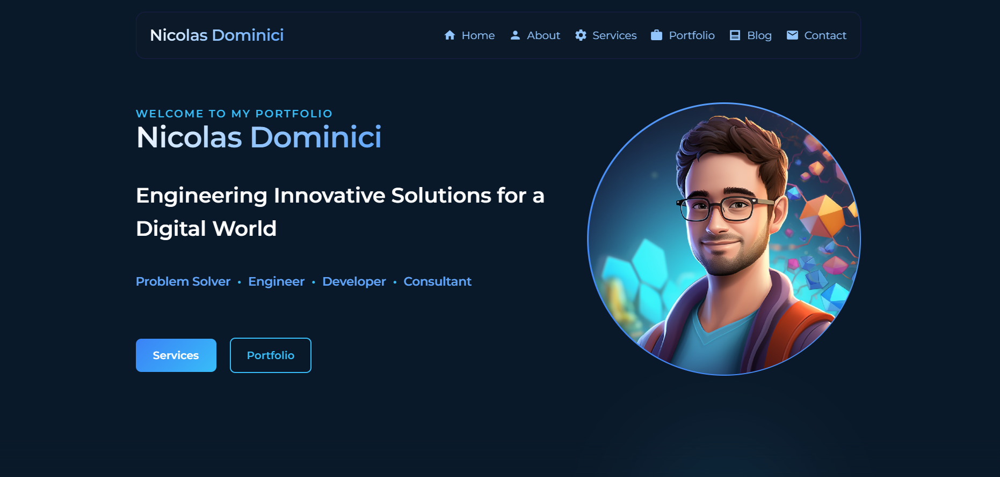

# AI Automation & Agentic Systems Portfolio (Astro)

Personal portfolio focused on AI Automation, agentic systems, and intelligent workflow orchestration. Built with Astro and React, it includes a portfolio showcase, services oriented to AI automation (n8n, multi‑agent/LLM pipelines), and a blog.



## Features

- 📱 Fully Responsive Design
- 💼 Portfolio Showcase
- ✍️ Blog with Markdown Support
- 🛠️ Services Section
- 📬 Contact Form with API Integration
- 🎨 Modern UI Components
- 🚀 Optimized Performance
- 📱 Social Media Integration

## Highlights

- 🏆 Seiling Buidlbox — 1st Prize (Tooling & Infrastructure), SEI AI/Accelathon
- 🏆 Hive Fi — 1st Prize (Sozu Virtual AI Hack)
- 🏆 AIgentlayer — 1st Prize (Gaia’s Autonomous Hackathon)
- ⚙️ Production‑ready n8n automations with robust error handling and retries
- 🤖 Agentic multi‑LLM workflows with tool use, routing, and RAG
- 🗃️ Vector/knowledge integrations: Supabase, Qdrant, Pinecone, Neo4j

## Table of Contents

1. [Getting Started](#getting-started)
2. [Project Structure](#project-structure)
3. [Portfolio Data Format](#portfolio-data-format)
4. [Blog Posts](#blog-posts)
5. [Technologies Used](#technologies-used)
6. [Environment Variables](#environment-variables)
7. [Adding Icons](#adding-icons)
8. [Components](#components)
9. [Adding Projects](#adding-projects)

## Getting Started

```bash
# Clone the repository
git clone https://github.com/nicoware-dev/0xn1co-portfolio

# Install dependencies
npm install

# Run development server
npm run dev
```

## Project Structure

```
src/
├── components/
│   ├── About/
│   ├── card-portfolio/
│   ├── hero/
│   ├── skills/
│   └── atoms/
├── content/
│   └── blog/
├── pages/
│   ├── api/
│   ├── blog/
│   └── services/
├── styles/
└── types/
```

## Portfolio Data Format

Add portfolio items in `src/components/data/portfolioData.ts`:

```typescript
interface PortfolioItem {
    imgSrc: string;
    title: string;
    skills: string[];
    description: string;
    demoURL?: string;
    repoURL?: string;
    anim?: string;
    averageBrightness?: number;
}
```

## Adding Projects

- Add a new object to `portafolioData` in `src/components/data/portfolioData.ts`
- Use category `"ai"` for AI/automation work to surface it first across the site
- Add an image under `public/assets/projects/` and reference it in `PROJECT_IMAGES`
- Example: Seiling Buidlbox is showcased in the AI category with the award note

## Blog Posts

Blog posts are written in Markdown format and stored in `src/content/blog/`. Each post should include frontmatter:

```markdown
---
title: Your Post Title
date: YYYY-MM-DD
description: Brief description of your post
---

Your content here...
```

## Technologies Used

- **Astro**: Modern static site generator
- **React**: UI component library
- **Tailwind CSS**: Utility-first CSS framework
- **Markdown**: Blog content formatting
- **TypeScript**: Type safety and better developer experience
- **n8n**: Workflow orchestration and automation
- **LLM APIs**: OpenAI, Anthropic, Gemini, DeepSeek, Ollama

## Environment Variables

Create a `.env` file in the root directory:

```env
# Required environment variables
DATABASE_URL=your_database_url
API_KEY=your_api_key
```

## Adding Icons

We use Iconify for icons. Add the script to your HTML:

```html
<script src="https://code.iconify.design/iconify-icon/2.1.0/iconify-icon.min.js"></script>
```

Usage example:

```html
<iconify-icon icon="logos:react" width="27" height="27"></iconify-icon>
```

## Components

Key components included:

- `Hero.astro`: Landing page hero section
- `Portfolio.astro`: Portfolio showcase
- `BlogHome.astro`: Blog listing component
- `About.astro`: About section
- `Skills.astro`: Skills showcase
- `SocialIcons.astro`: Social media links
- `CardPortfolio.astro`: Portfolio item card

## License

This project is licensed under the MIT License. See the [LICENSE](LICENSE) file for details.

## Author

Nicolas Dominici

## Support

For support, email nicolasdominici@outlook.com or open an issue in the repository.
